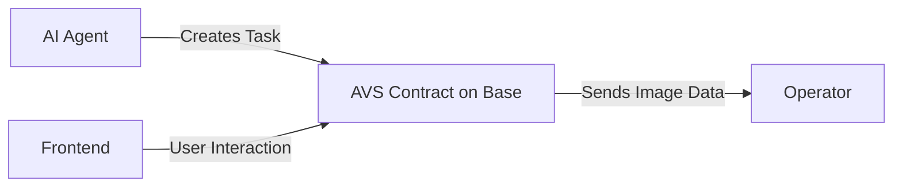

<a href="https://decentralised-sam.vercel.app/">
  <h1 align="center">Decentralised S.A.M. (Species Assessment Mapper)</h1>
</a>

<p align="center">
Submission for Agentic Etheruem.
</p>

<p align="center">
A Decentralised AI Robotic Agent that maps out invasive species and uploads them to the blockchain to avoid censorship.
</p>

<p align="center">
  <a href="#todo"><strong>TODO</strong></a> ·
  <a href="#diagrams"><strong>Diagrams</strong></a> ·
  <a href="#clone-and-run-locally"><strong>Guide</strong></a> ·
</p>
<br/>

## TODO

### AI Agent (AgentKit)

-   [ ] Initialise Repo
-   [ ] Upload Image to IPFS
-   [ ] Create Tasks / Sightings for AVS (Upload location + IPFS Hash)

### AVS

-   [ ] Create Task / Sightings Structure
-   [ ] Create Task / Sightings Event Emitter
-   [ ] Create Operator Code on Task / Sightings(Run AI Modal)

### Frontend

-   [ ] View Sightings with Location and Image
-   [ ] Vote for whether it's correct

## Diagrams



## Clone and run locally

1. You can now run the Next.js local development server:

    ```bash
    npm run dev
    ```

    The starter kit should now be running on [localhost:3000](http://localhost:3000/).
