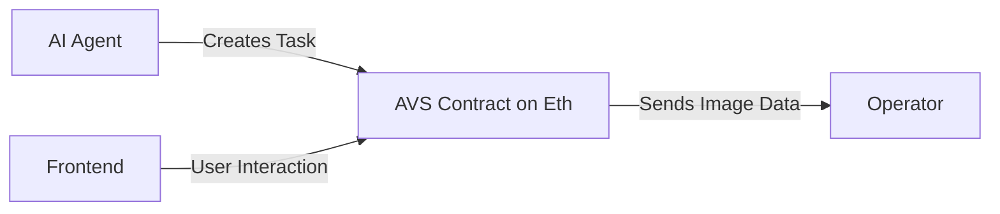

<a href="https://decentralised-sam.vercel.app/">
  <h1 align="center">Decentralised S.A.M. (Species Assessment Mapper)</h1>
</a>

<p align="center">
Submission for Agentic Etheruem.
</p>

<p align="center">
A Decentralised AI Robotic Agent that maps out invasive species and uploads them to the blockchain to avoid censorship.
</p>

<p align="center">
  <a href="#diagrams"><strong>Diagrams</strong></a> ·
  <a href="#clone-and-run-locally"><strong>Guide</strong></a> ·
</p>
<br/>

## Diagrams



## Clone and run locally

### Contracts Instructions

1. Enter the contracts directory and start the local server with:

    ```bash
    anvil --chain-id 31337 --fork-url https://holesky.drpc.org
    ```

2. Run the deployment script with:

    ```bash
    forge script script/DeploySAMServiceManager.sol --rpc-url http://localhost:8545 --broadcast
    ```

3. Enter the operator directory under contracts and run the operator respondTask script

    ```bash
    bun run respondTask.ts
    ```

4. On a separate terminal, enter the operator directory under contracts and run the createTask script

    ```bash
      bun run createTask.ts
    ```

    You should see the `createTask` script create a `createTask` Transacton followed by the `respondTask` script create a `respondToTask` Transaction.

### Frontend Instructions

1. Enter the frontend directory and install the dependencies needed

    ```bash
    yarn install
    ```

2. You can now run the Next.js local development server:

    ```bash
    yarn dev
    ```

    The frontend should now be running on [localhost:3000](http://localhost:3000/).
